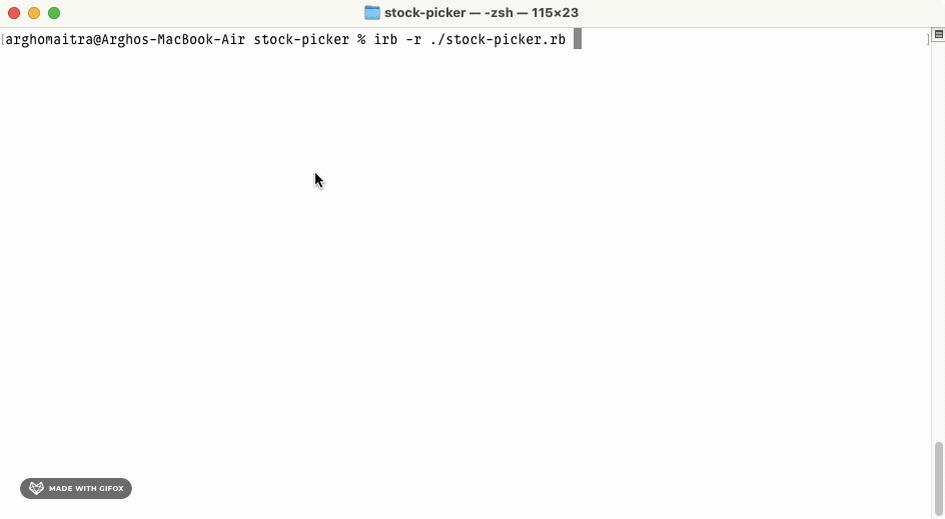

  <h1>Stock Picker</h1>

  The Best Day to Buy and Sell Stocks

## About
`stock-picker` is a classic "intro to programming problem" wherein the method `stock_picker(stock_prices)` takes in an array of stock prices and returns a pair of days representing the best day to buy and the best day to sell.[^1]

[^1]: [This project](https://www.theodinproject.com/lessons/ruby-stock-picker) is from the [Ruby Course](https://www.theodinproject.com/paths/full-stack-ruby-on-rails/courses/ruby) in [The Odin Project](https://www.theodinproject.com/about).

## Showcase

  
  

  
This is a screen cast of the Stock Picker.

## Technologies
- ***Git***
- ***CLI***
- ***Ruby***
- ***GitHub***
- ***GitHub Pages***

## Self Reflections
- > I ended up choosing the [Full Stack Ruby on Rails](https://www.theodinproject.com/paths/full-stack-ruby-on-rails) path. As a result, I've started with the [Ruby Course](https://www.theodinproject.com/paths/full-stack-ruby-on-rails/courses/ruby) and learned quite a lot of things like basic data types, variables, input and output, conditional logic, loops, arrays, hashes, methods, debugging, basic and predicate enumerable methods, and nested collections.

## Acknowledgements
- Credit for README goes to [ritaly's README cheatsheet](https://github.com/ritaly/README-cheatsheet) and [ArjunSaili1's comment](https://github.com/TheOdinProject/curriculum/discussions/25472#discussioncomment-5889343).

## Contact and Support
- Please do not hesitate to contact me at ***ohgrmait_02945*** on discord for any project queries.
- This project will no longer be worked upon and no further support will be provided for this project.